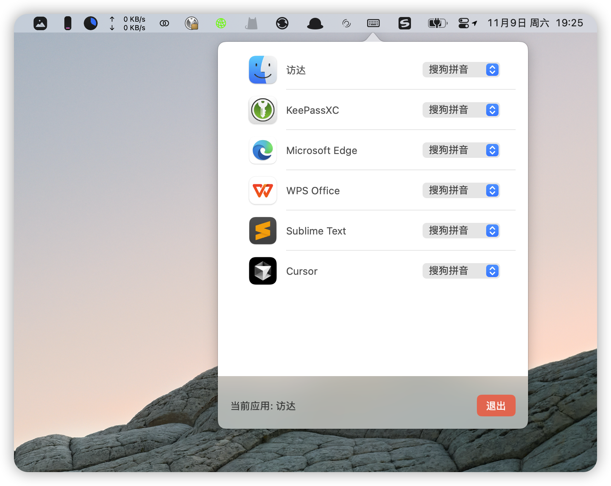

# 🤖 Mac自动切换输入法 (AI助手开发)

一个使用 AI 辅助开发的 macOS 输入法切换工具，通过 Cursor AI 零代码开发。让输入法切换不再困扰你的工作。

## 为什么需要这个工具？

### 解决 macOS 输入法切换的痛点
- macOS 经常会自动将输入法切换到英文
- 系统自带的"切换到文稿输入法"功能判定混乱，毫无规律地切换到英文
- 输入一大段文字后才发现是英文输入法，不得不删除重来
- 频繁的手动切换输入法严重影响工作效率

### 节省宝贵的时间
- 每次手动切换输入法平均需要 2 秒
- 假设每天切换 100 次，一年就是 3 万多次切换
- 每年仅在切换输入法上就浪费约 20 个小时
- 对于重度电脑用户，切换次数可能远超 3 万次

## 功能特点

- 自动检测当前激活的应用程序
- 根据应用程序自动切换到预设的输入法
- 状态栏图标，后台静默运行
- 点击状态栏图标显示配置界面
- 优化了输入法切换的成功率
- 简洁的用户界面，易于配置
- AI 设计的应用图标，简洁现代
- 支持原生 Apple M 系列和 Intel 芯片

## 开发特色

本项目是一个完全由 AI 辅助开发的应用程序：
- 使用 Cursor AI 进行全程零代码开发
- 通过 AI 进行界面设计和优化
- 应用图标由 AI 设计工具生成
- 零编程基础实现功能开发

## 更新内容

相比原版本改进：
- 优化了输入法切换逻辑，提高了切换的成功率
- 移除了独立窗口，改为状态栏模式运行
- 默认启动到状态栏后台运行，不显示主窗口
- 点击状态栏图标显示悬浮配置窗口
- 增加了退出应用按钮
- 界面更加简洁直观
- 全新的 AI 设计图标

## 原作者
- 邮箱：ash_mica@163.com

## 当前维护者
- 邮箱：happnuyear@sina.com

## 开发工具
- Cursor AI：代码开发和优化
- 豆包：应用图标设计

## 致谢
感谢原作者开发的优秀工具，本版本在其基础上通过 AI 辅助进行了功能优化和界面改进。这个项目也证明了 AI 辅助开发工具在实际应用中的强大潜力。